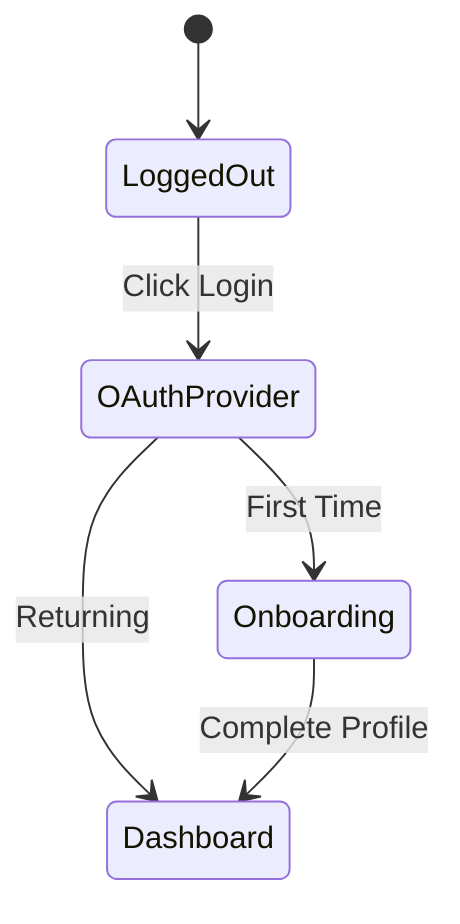
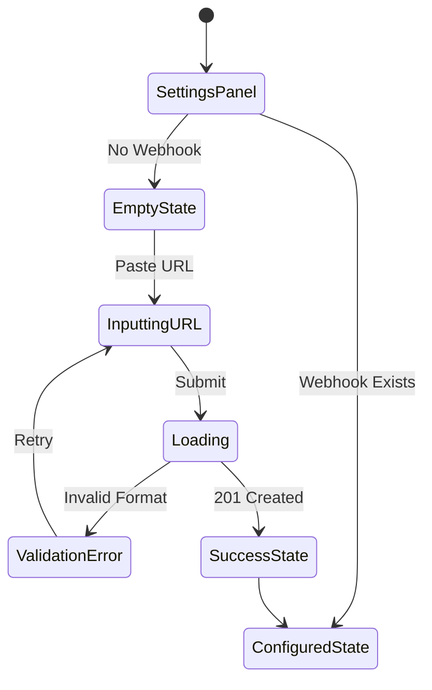

# Product Flows & User Journeys

This document is the global registry for all UI state diagrams and user journeys. It is used by the Design agent for flow reusability and by the Engineering agent for Artifact Triangulation against Data Contracts.

## 🧭 Global Flow Directives
- **Idempotency:** When adding or updating a flow for a feature, explicitly name the feature block using an H3 (`###`). If the feature already exists, OVERWRITE the existing block; do not endlessly append duplicate flows.
- **Format:** All diagrams MUST be written inside standard markdown `mermaid` code blocks.

---

## 🧩 Core System Flows
*(Global application shells, authentication, and core navigation)*

### Authentication / Onboarding

---

## 🚀 Active Feature Flows
*(Append new feature flows below this line)*

### Discord Webhooks
